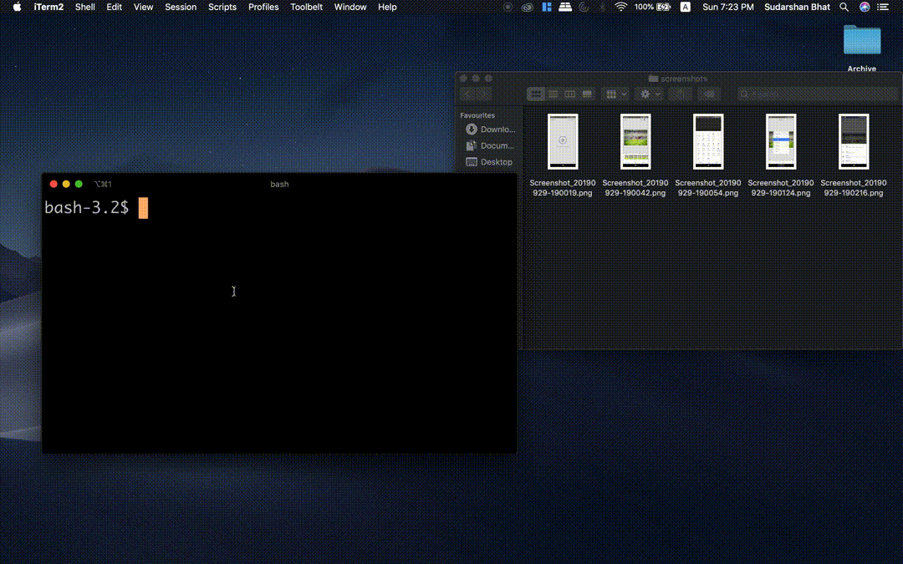

# imgtrain

Simple command-line utility to merge a set of images/screenshots into a banner with all images lined up one after other. 

## Demo 

  

## Download

Download the latest binary from [releases](https://github.com/sudarshanpbhat/imgtrain/releases). 

## Usage 

#### Syntax - 

<pre>
imgtrain [-h] [--bg-color BG_COLOR] [--border-size BORDER_SIZE]
                [--space-between-images SPACE_BETWEEN_IMAGES] [-o OUTPUT]
                image_files [image_files ...]
                
optional arguments:
  -h, --help            show this help message and exit
  --bg-color BG_COLOR   Set the background image color
  --border-size BORDER_SIZE
                        Set the border size.
  --space-between-images SPACE_BETWEEN_IMAGES
                        Set space between images.
  -o OUTPUT, --output OUTPUT
                        Set output file name.
</pre> 

#### Example -

Since the defaults used are optimal to most use-cases, your command can be as simple as this - 

<pre>
./imgtrain screen1.png screen2.png  
</pre>

`output.jpeg` should have the stitched banner. 

## Why imgTrain? 

How many times have you been asked to post a "before" and "after" screenshot of a design you worked on? 
How often have you felt that a PR you raised could have been so much more powerful with a list of screenshots? 
How often have you added screenshots of your app on a presentation that you made to your client? 

It may have not been a lot, but when it did, it must have been frustrating. It's simple, but boring and time consuming. And more often than not, these situations end up exactly when you're busy with something more important. 

So `imgtrain` is your simple solution. One single command and your banner of screenshots is ready to use. 
